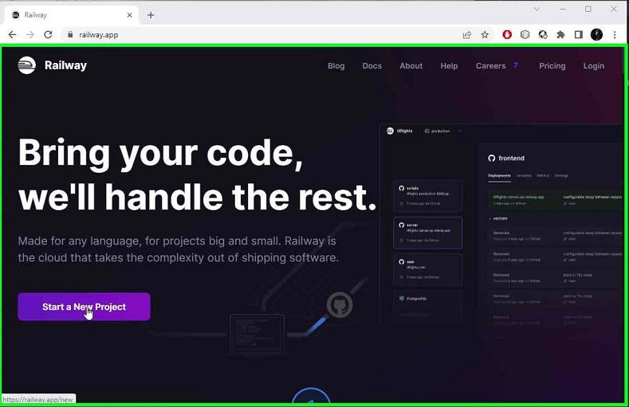
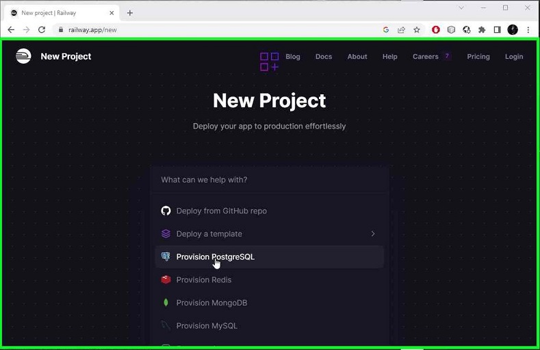
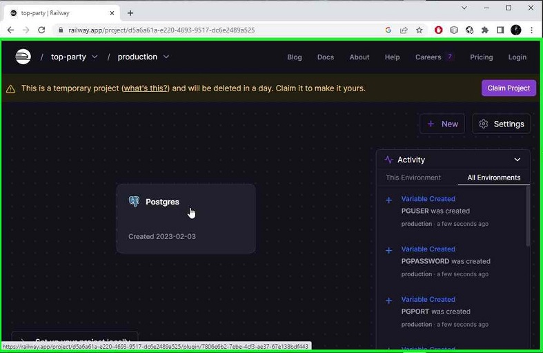
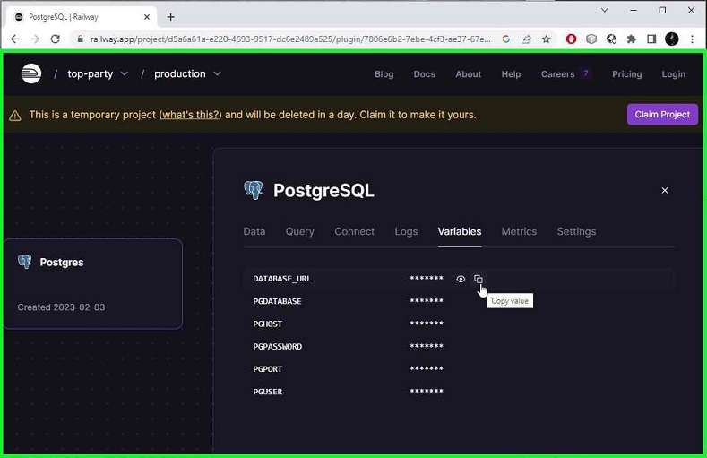
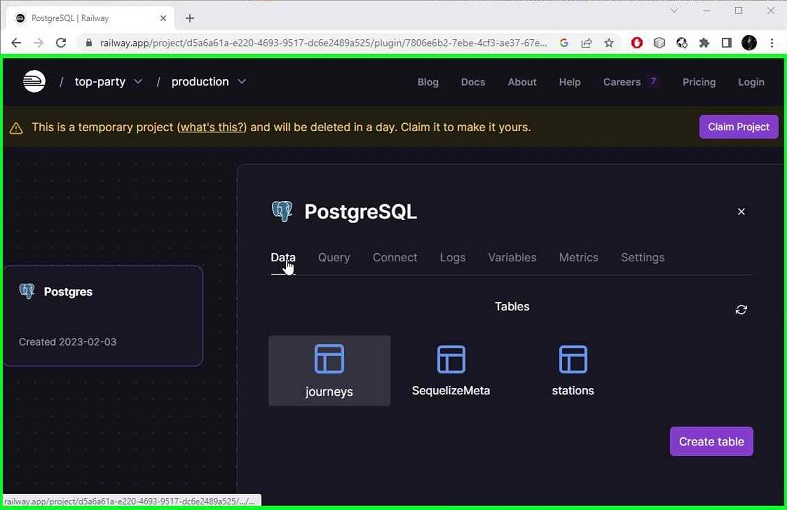

## Cloud database setup 

Railway.app provides a quick way to set up a cloud based database.

Go to https://railway.app/

From the front page click `Start a new project` button



From the list select `Provision PostgreSQL` to create a new PostgreSQL database.



The service will create a new database for you, this will take a few secons. 

When the database is ready, click on the card to see more.



Click on the Variables -tab to see the information needed to connect to this database.



Next, we need to create a file named .env in the root of server folder.

The contents of the file should have the following fields with the information from the website:

```
PGUSER='postgres'
PGHOST='pghost'
PGPASSWORD='password'
PGDATABASE='railway'
PGPORT=1234
```

To check that the connection is working, in the server folder, start the server with the following command:
```
$ npm start
```
and it should prompt for succesful connection
```
Connection has been established successfully.
Server running on port 3001
```
You can close the server by pressing `ctrl + C`

## Creating database tables
In order to use the database, we need to create the tables first. 

This can be done with the `npm run migrate` command in the server directory:

```
$ npm run migrate

Loaded configuration file "config\config.js".
Using environment "development".
== 20230118072806-init: migrating =======
== 20230118072806-init: migrated (0.922s)

```

You can check that the tables have been created on the data-tab on the website.

You should see that the tables were created.



Next, [add data to the database](../README.md#adding-data-to-the-database).